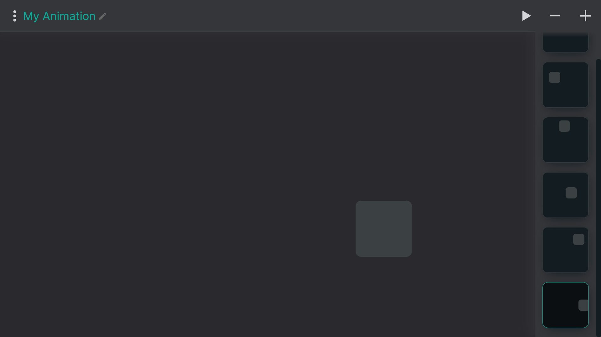

  

<h1 align="center">Filmstrip</h1>

  <h3 align="center">  
    Animate keyframes and get CSS
  </h3>

  
  

## Did you know that you can create animation using just CSS?

**Filmstrip** is an online editor that helps you with that task.

Combining the power of both **positioning** and **keyframes** CSS properties, you will get CSS code ready to use in your site.

Furthermore, you can place the exported animation **anywhere** and add on to **any element**.

:pencil2: [Try it out](https://filmstrip.netlify.app/)

  

Creating new keyframes is easy. Just drag from one point to another.

## Built by hand with :heart:
- No external libraries or technolgies.

## Contributing

#### Help me improve it :seedling:

Please create a GitHub issue if there is something wrong or needs to be improved. Pull requests are also welcome.

## License

[MIT](https://opensource.org/licenses/mit-license.php)
Copyright © 2020 Bar Hatsor (<a href="https://codepen.io/barhatsor">@barhatsor</a>)
